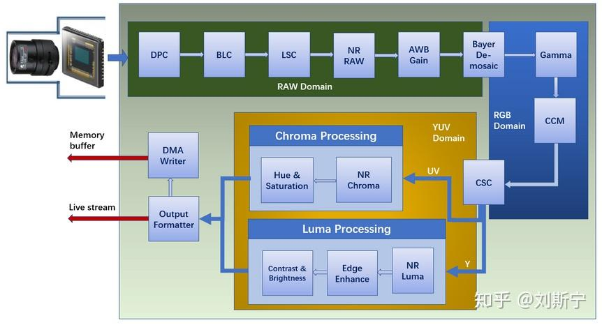
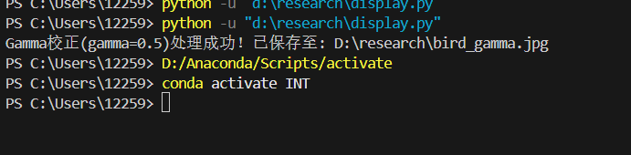

# 数字图像理解  
每个像素值代表每个像素点的亮度，通过RGB像素矩阵可以合成彩色图像，灰度图表示亮度强弱
# ISP框架
ISP承接传感器输出，输出RGB格式数据，一般sensor输出raw格式数据，要转换成RGB/YUV格式，进一步转化成JPEG格式进行保存。
## RAW domain
- BPC坏点校正  
坏点指的是像素阵列中与周围像素点的变化表现出明显不同的像素
- BLC黑电平校正  
单个像素点有效值是0\~255，但电压值很小的部分由于精度原因可能无法转换出来，因此加上固定偏移量，即像素点值5\~255，可能损失部分亮部细节
- LSC镜头阴影校正  
入射光线不足会形成暗角（luma shading） 不同频率光折射率不同(color shading)
- RAW域降噪  
光照程度和传感器问题都在生成图像过程中产生大量噪声，需要进行去噪，一般采用非线性去噪（双边滤波器），考虑像素在空间中的距离和像素点之间的相似程度
- AWB Gain白平衡增益  
不同色温光源下，物体出现偏色。白平衡去除环境光的影响，还原真实颜色。在任意环境下，将白色物体还原成白色物体
- Bayer Demosaic RGB插值 
对像素的颜色信息（R-G-G-B）进行插值，为每个像素计算出缺失的另外两个颜色通道，将单通道RAW图像恢复成三通道的RGB图像
## RGB domain
- gamma校正  
模仿人眼对外界光源的感光值与输入光强呈指数型关系，即对输入的灰度值进行非线性操作，使得输入与输出灰度值呈指数关系。
- CCM颜色矫正矩阵  
sensor的RGB响应曲线与人眼感知存在差异
- CSC颜色空间变换  
YUV是基本色彩空间，人眼对亮度Y敏感性比色彩变化大很多，因此Y分量比UV分量重要
## YUV domain
- 颜色降噪
- 色调色饱和度控制
- 边缘增强
- 对比度、亮度控制
- 图像格式转换
- 写DMA

# 像素矩阵特点
①离散性，现实场景离散成像素矩阵，亮度和色彩进行量化
②彩色图像三维矩阵，灰度图像二维矩阵
③局部相关性，相邻像素点之间颜色和亮度具有高度相似性

# gamma校正样例（γ=0.5）

