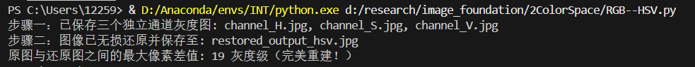
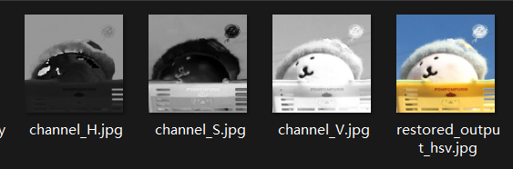
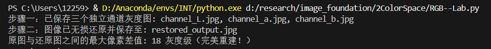
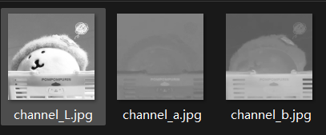

# RGB
### 物理含义
红绿蓝三原色，每种颜色用三个通道的强度值表示
### 主要特点
易于理解，但与人眼感知色彩有差别，不适合颜色分析
### 使用场合
用于显示设备，摄像头图像采集，数字图像处理
# HSV
### 物理含义
色相（用角度表示），饱和度（颜色纯度，0到1，0为灰色），明度（颜色亮度，0到1，0表示黑色）
### 主要特点
与人眼感知色彩相似
### 使用场合
颜色分割（基于颜色的物体识别）、图像增强和修正（调整色调或饱和度）、图像分析和计算机视觉
# Lab
### 物理含义
描述人类视觉感知到的颜色  
L（亮度） a（红绿轴，负值为绿，正值为红）b（黄蓝轴，负值为蓝，正值为黄）
### 主要特点
具有设备无关性，不依赖于显示设备或照明条件，适用于高精度颜色管理
### 使用场合
常用于颜色管理和色彩匹配
# YCbCr
### 物理含义
Y（图像亮度信息）Cb（蓝色差分量，蓝色与亮度的差异） Cr（红色差分量，红色与亮度的差异）
### 主要特点
减少数据量
### 使用场合
视频压缩和编码，视频信号的处理和传输  
# RGB<->HSV转换

## RGB->HSV
①计算最大值与最小值  
max_val = max(r, g, b)  
min_val = min(r, g, b)  
C = max_val - min_val色度  
②计算明度   
V = max_val  
③计算饱和度  
$$S = \begin{cases} 
\frac{C}{max\_val}  & \text{if } \text{max\_val} > 0 \\ 
0, & \text{otherwise} 
\end{cases}
$$
④计算色调  
$$
H_{\text{sector}} = \begin{cases} 
\left( \frac{g - b}{C} \right) \bmod 6, & \text{max\_val} = r \\
\frac{b - r}{C} + 2, & \text{max\_val} = g \\
\frac{r - g}{C} + 4, & \text{max\_val} = b
\end{cases}  
$$
$$
H = \frac{H_{\text{sector}}}{6}
$$
## HSV->RGB
根据色调H处于360°圆环中哪一个扇区来决定RGB的分配权重  
①计算扇区和偏移量  
$$h_i = \lfloor \frac{H}{60} \rfloor \pmod 6$$
$$f = \frac{H}{60} - \lfloor \frac{H}{60} \rfloor$$
②计算中间分量p,q,t
$$p = V \times (1 - S)$$
$$q = V \times (1 - f \times S)$$
$$t = V \times (1 - (1 - f) \times S)$$
③分扇区映射
* 若 $h_i = 0$：$(R, G, B) = (V, t, p)$
* 若 $h_i = 1$：$(R, G, B) = (q, V, p)$
* 若 $h_i = 2$：$(R, G, B) = (p, V, t)$
* 若 $h_i = 3$：$(R, G, B) = (p, q, V)$
* 若 $h_i = 4$：$(R, G, B) = (t, p, V)$
* 若 $h_i = 5$：$(R, G, B) = (V, p, q)$
# RGB<->Lab转换
 
## RGB->Lab
- 利用以下公式将RGB转换为XYZ
  - X = 0.412453R + 0.357580G + 0.180423B
  - Y = 0.212671R + 0.715160G + 0.072169B
  - Z = 0.019334R + 0.119193G + 0.950227B
- 将XYZ转换为Lab
  - L = 116f(Y/Yn) - 16 (对于Y/Yn > 0.008856时，L = 116 * Y/Yn - 16，否则L = 903.3 * Y/Yn)
  - a = 500 * (f(X/Xn) - f(Y/Yn))
  - b = 200 * (f(Y/Yn) - f(Z/Zn))
  - 其中f(x)是辅助函数，对于x > 0.008856时，f(x) = x^(1/3)，否则f(x) = (7.787x + 4/29)
  - Xn, Yn, Zn是XYZ色彩空间的白色参考点，通常是D65标准光源的值。
## Lab->RGB
- Lab->XYZ
  - 计算中间因子 
  $$f_y = \frac{L + 16}{116}$$
  $$f_x = f_y + \frac{a}{500}$$
  $$f_z = f_y - \frac{b}{200}$$
  - 反向非线性映射
  $$x_r = \begin{cases} f_x^3 & \text{if } f_x > \delta \\ 3\delta^2 \cdot (f_x - \frac{4}{29}) & \text{otherwise} \end{cases}$$
  - 结合白点计算XYZ坐标
  $$X = x_r \cdot X_n, \quad Y = y_r \cdot Y_n, \quad Z = z_r \cdot Z_n$$
- XYZ->RGB 
  - XYZ->线性RGB
   $$\begin{bmatrix} R_{\text{linear}} \\ G_{\text{linear}} \\ B_{\text{linear}} \end{bmatrix} = \begin{bmatrix} 3.2404542 & -1.5371385 & -0.4985314 \\ -0.9692660 & 1.8760108 & 0.0415560 \\ 0.0556434 & -0.2040259 & 1.0572252 \end{bmatrix} \begin{bmatrix} X \\ Y \\ Z \end{bmatrix}$$
   - 线性RGB->标准sRGB(gamma变换)
  $$C_{\text{srgb}} = \begin{cases} 12.92 \cdot C & \text{if } C \le 0.0031308 \\ 1.055 \cdot C^{1/2.4} - 0.055 & \text{if } C > 0.0031308 \end{cases}$$