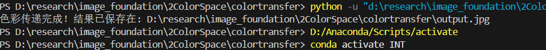

# 颜色传递结果



# ColorTransfer
核心思想:RGB数据通常高度相关，如果想要改变某一个通道数，另外两个通道也会发生复杂变化，导致画面色彩失真产生偏色。那为了独立改变色彩而不破坏画面协调感，将图像转换到一个三通道彼此独立的颜色空间，即解耦。
### 标准Lab  
RGB->XYZ->Lab(矩阵＋立方根映射)
### ruderman lαβ
①RGB->LMS->log LMS->lαβ（视锥矩阵+对数映射+正交旋转矩阵）
去相关效果更好，常用于色彩迁移和自然场景分析  
②色彩匹配  
对源图像 $`S`$ 的每一个通道（$`c \in \{l, \alpha, \beta\}`$），执行缩放和平移，以匹配目标图像 $`T`$ 的均值 $`\langle c \rangle`$ 与标准差 $`\sigma_c`$：

```math
c_{\text{new}} = \frac{\sigma_{T, c}}{\sigma_{S, c}} \left( c_S - \langle c_S \rangle \right) + \langle c_T \rangle
```

*   $`(c_S - \langle c_S \rangle)`$：使源图色彩中心归零，去除其原本的整体色调。
*   乘以 $`\frac{\sigma_{T, c}}{\sigma_{S, c}}`$：将源图色彩通道的动态范围（对比度/饱和度）缩放到目标图相同的程度。
*   加上 $`\langle c_T \rangle`$：将源图中心整体移动到目标图的色调中心，使其“染上”目标图的氛围。


③反向转换（$`l\alpha\beta`$ $`\rightarrow`$ RGB）

为了能够将处理后的图像重新保存和显示，需要进行严格的数学逆运算：

Step 1: 旋转变换回对数 LMS 空间（利用正交矩阵的转置即其逆矩阵的特性）
```math
\begin{bmatrix} \mathbf{L} \\ \mathbf{M} \\ \mathbf{S} \end{bmatrix} = \begin{bmatrix} \frac{\sqrt{3}}{3} & \frac{\sqrt{6}}{6} & \frac{\sqrt{2}}{2} \\ \frac{\sqrt{3}}{3} & \frac{\sqrt{6}}{6} & -\frac{\sqrt{2}}{2} \\ \frac{\sqrt{3}}{3} & -\frac{\sqrt{6}}{3} & 0 \end{bmatrix} \begin{bmatrix} l_{\text{new}} \\ \alpha_{\text{new}} \\ \beta_{\text{new}} \end{bmatrix}
```

Step 2: 消除对数（幂运算还原）
```math
L = 10^{\mathbf{L}}, \quad M = 10^{\mathbf{M}}, \quad S = 10^{\mathbf{S}}
```

Step 3: LMS 空间乘逆矩阵转回 RGB 空间
```math
\begin{bmatrix} R \\ G \\ B \end{bmatrix} = \begin{bmatrix} 4.4679 & -3.5873 & 0.1193 \\ -1.2186 & 2.3809 & -0.1624 \\ 0.0497 & -0.2439 & 1.2045 \end{bmatrix} \begin{bmatrix} L \\ M \\ S \end{bmatrix}
```

