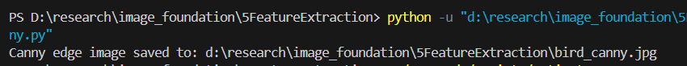
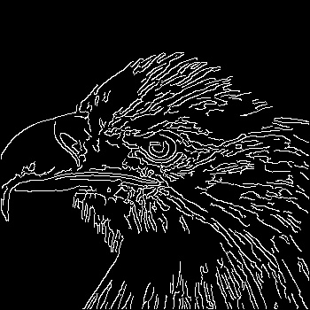

# 特征提取
## 一.Canny边缘检测
- 论文思想
    - 优秀检测器三个标准：检测率高，定位准确，一个边缘只产生一次响应
    - 检测能力（需要大滤波器）与定位能力（需要小滤波器）存在天然矛盾
    - 检测率高要求噪声少，定位精确要求边缘位置不模糊
    - 最优边缘检测器形状：高斯一阶导数
- 最终算法流程
    - 高斯滤波去噪

    ```math
    G(x)=\frac{1}{\sqrt{2\pi}\sigma}e^{-\frac{x^2}{2\sigma^2}}
    ```

    - 求梯度
  
    ```math
    G_x  G_y
    ```

    ```math
    M=\sqrt{G_x^2+G_y^2}
    ```

    梯度方向

    ```math
    \theta=\tan^{-1}\left(\frac{G_y}{G_x}\right)
    ```

    - 非极大值抑制
    比较该像素点和其梯度正负方向的像素点的梯度强度，如果该点梯度强度最大就保留，否则抑制（置0）
    - 双阈值  
 
    强边缘：

    ```math
    M>TH
    ```

    弱边缘：

    ```math
    TL<M<TH
    ```

    噪声：

    ```math
    M<TL
    ```

    - 滞后阈值连接
    若弱边缘与强边缘相连则保留，否则删除
- 手写 Canny 边缘检测
  - 补充Sobel算子
    - Sobel平滑向量： $[1\quad2\quad1]$
    - Sobel求导向量： $[-1\quad0\quad1]$
    - Sobel X算子
  
    ```math
    G_x=
    \begin{bmatrix}
    -1 & 0 & 1 \\
    -2 & 0 & 2 \\
    -1 & 0 & 1
    \end{bmatrix}
    ```

    - Sobel Y算子

    ```math
    G_y=
    \begin{bmatrix}
    -1 & -2 & -1 \\
    0 & 0 & 0 \\
    1 & 2 & 1
    \end{bmatrix}
    ```

处理流程：
1. 将 BGR 彩色图像转换为灰度图。
2. 使用固定的 5×5 高斯核抑制噪声。
3. 使用 Sobel 算子计算梯度幅值和方向。
4. 沿梯度方向进行非极大值抑制，细化边缘。
5. 使用双阈值区分强边缘和弱边缘，再通过八邻域滞后连接保留有效弱边缘。


## 二.SIFT特征点提取
人眼区分不同内容的图像时，人眼的做法是匹配一些图像关键点，因此SIFT将图像特征的提取和描述的问题转化为寻找图像关键点和基于关键点的图像特征描述子的问题。
#### 算法主要步骤
- 尺度空间的极值检测
    - 高斯滤波
      - 增大 $\sigma$ （图越来越模糊）
      - 降采样
      - 两者结合形成高斯金字塔
    - 高斯差分
      - 对同一尺度下不同高斯滤波的图像进行差分
      - 经过高斯差分得到的图像更能图像图像的特征，无用成分进一步缩减，图像的边缘、轮廓进一步突显
    - 局部极值
      - SIFT算法选择高斯差分金字塔中的极值点作为特征关键点
- 关键点的精确定位
  - 对比测试：解决对比度较低的极值点，对所有极值点进行二阶泰勒展开，如果结果值太小就剔除关键点
  -  边缘测试：使用hessian矩阵识别具有高边缘度但对少量噪声没有鲁棒性的关键点。
- 关键点主方向分配
  - 梯度方向直方图中最高的bin对应的方向定义为该关键点的主方向 关键点信息：位置(x,y),尺度 $\sigma$ ,方向 $\theta$ 。
- 关键点描述子的生成
  - 算法将特征点周围16×16领域分为4×4个4×4领域，每个4×4领域有8个bin，一共128个bin，对应生成128维向量，即为该点的特征描述子

处理流程：
1. 将彩色图像转换为灰度图，并为检测过程等比例降采样。
2. 使用离散高斯核构建多 octave、多尺度的高斯金字塔。
3. 相邻高斯图像相减，建立 DoG（Difference of Gaussian）金字塔。
4. 在当前尺度及上下相邻尺度的 26 邻域中检测极值点。
5. 根据对比度和 Hessian 矩阵剔除不稳定点及边缘响应点。
6. 统计关键点邻域的梯度方向，为关键点分配主方向。
7. 将邻域划分为 4×4 个区域，每个区域统计 8 个方向，生成 128 维描述子。
8. 在原图上绘制关键点的尺度圆和主方向线。

### SIFT 特征匹配
- 基本方法
  - 欧氏距离匹配：计算两个特征描述子之间的欧氏距离，选择最近的特征点作为匹配点。
  - 最近邻比值筛选
    - 计算最近邻和次近邻的距离比值
    - 若比值小于设定阈值，保留该匹配

处理流程：
1. 分别提取 `work_front.jpg` 和 `work_left.jpg` 的 SIFT 关键点及 128 维描述子。
2. 手写计算两个描述子之间的欧氏距离。
3. 使用最近邻与次近邻的距离比值剔除模糊匹配。
4. 使用双向最近邻检查，要求两个关键点互相选择对方。
5. 根据匹配点主方向差的一致性进一步过滤误匹配。
6. 在两张结果图中使用相同颜色标记同一对匹配点。


| work_front 匹配点 | work_left 匹配点 |
| --- | --- |
|  |  |
