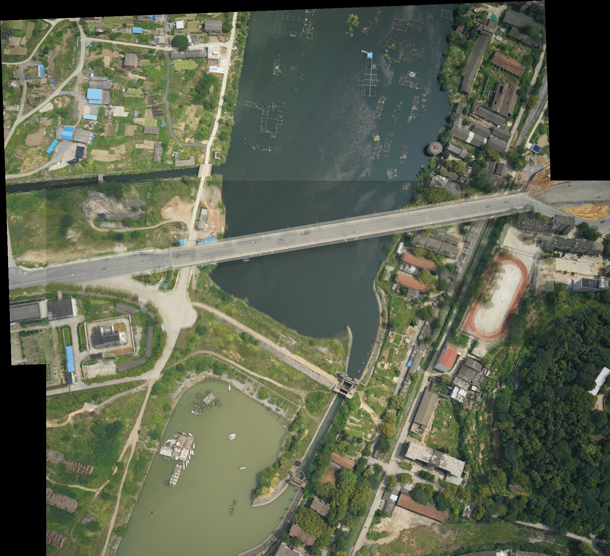

## 图像拼接

大致思路：

① 对每幅图进行特征点提取  
② 对特征点进行匹配  
③ 进行图像配准  
④ 把图像拷贝到另一幅图像特定位置  
⑤ 对重叠边界进行特殊处理

这里提取特征点（SIFT）和特征点匹配都在前面实现过，因此重点在最小二乘法求仿射变换的矩阵，最后融合两张图。

- 最小二乘法
  - 最小二乘法损失函数：$L = \sum_{i=1}^{n} \left( y_i - f(x_i) \right)^2$
    - 线性模型：$h_\theta(x_1, x_2, \dots, x_{n-1}) = \theta_0 + \theta_1 x_1 + \cdots + \theta_{n-1} x_{n-1}$
    - 批量形式（m 个样本，n-1 维特征）：$h_i = \theta_0 + \theta_1 x_{i,1} + \theta_2 x_{i,2} + \cdots + \theta_{n-1} x_{i,n-1}$
    - 矩阵形式：$h = X\theta$
  - 损失函数矩阵形式：$J(\theta) = \|h - Y\|^2 = \|X\theta - Y\|^2$
    - 展开：$J(\theta) = (X\theta - Y)^T (X\theta - Y)$
    - 进一步展开：$J(\theta) = \theta^T X^T X \theta - \theta^T X^T Y - Y^T X \theta + Y^T Y$
    - 向量求导基本公式
      - $\frac{\partial (x^T a)}{\partial x} = a$
      - $\frac{\partial (x^T A x)}{\partial x} = A x + A^T x$
  - 损失函数对 $\theta$ 求导
    - $\frac{\partial J(\theta)}{\partial \theta}= 2X^T X \theta - 2X^T Y$
    - $X^T X \theta = X^T Y$ => $\theta = (X^T X)^{-1} X^T Y$
  - 几何意义
    - 求解 b 在 A 的列向量空间的投影
    - X 代表 A 的列向量的线性组合，这里 X 是 $\theta$，A 的列向量代表 n-1 维的特征值

- 岭回归与 L2 正则化（加入先验概率分布）
  - $w= \arg\min_{\mathbf{w}}\frac{1}{n} \sum_{i=1}^{n} (x_i^T \mathbf{w} - y_i)^2+ \lambda \|\mathbf{w}\|_2^2$
  - 闭式解：$\mathbf{w} = (X X^T + \lambda I)^{-1} X y$

## 本次代码实现与运行结果

代码文件：`parameter_optimization/Image_stitching/image_stitching.py`

运行命令：

```bash
python parameter_optimization/Image_stitching/image_stitching.py
```

默认输入：

- `parameter_optimization/Image_stitching/test_pair/001.png`
- `parameter_optimization/Image_stitching/test_pair/002.png`

默认输出：

- `stitched_result.jpg`：最终拼接图
- `matches_visualization.jpg`：匹配点可视化结果
- `matches.csv`：匹配点坐标、描述子距离和方向差

最终图像拼接结果：



终端运行结果：

```text
first keypoints: 140
second keypoints: 140
matches: 23
least-squares inliers: 12
affine matrix:
[[ 9.66349651e-01  2.99531332e-02 -1.30867818e+02]
 [-3.58230561e-02  9.19037952e-01 -4.55041940e+02]
 [ 0.00000000e+00  0.00000000e+00  1.00000000e+00]]
saved: D:\research\parameter_optimization\Image_stitching\stitched_result.jpg
```

说明：

- 第一张图检测到 `140` 个 SIFT 特征点。
- 第二张图检测到 `140` 个 SIFT 特征点。
- 可靠匹配点为 `23` 对，满足题目要求的“大于 10 对匹配点”。
- 经过平移一致性筛选后，使用 `12` 对内点参与仿射矩阵最小二乘求解。
- 最终拼接结果保存为 `stitched_result.jpg`。
