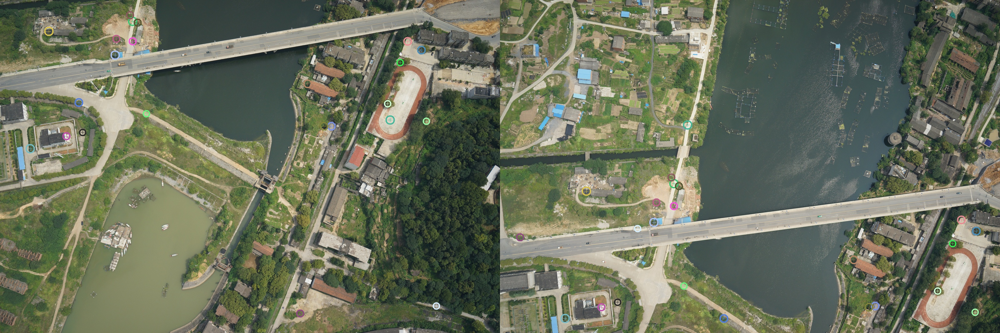

# 图像拼接

本文件夹实现两张具有重叠区域图像的自动拼接实验。代码复用了 `Image_foundation/5FeatureExtraction/code` 中已经手写完成的 SIFT 特征点提取和匹配模块，本实验重点放在最小二乘法求解仿射变换、图像反向映射和融合。

## 文件说明

```text
Image_stitching/
├── image_stitching.py          # 图像拼接主程序
├── README.md                   # 实验说明与运行结果
├── test_pair/
│   ├── 001.png                 # 第一张测试图
│   └── 002.png                 # 第二张测试图
├── stitched_result.jpg         # 最终拼接结果
├── matches_visualization.jpg   # 匹配点可视化结果
└── matches.csv                 # 匹配点坐标和距离记录
```

## 基本思路

1. 对两张图分别进行 SIFT 特征点提取。
2. 对特征描述子进行匹配，得到两张图中的对应点。
3. 根据匹配点构造仿射变换方程。
4. 使用最小二乘法求解仿射变换参数。
5. 将第二张图反向映射到第一张图所在坐标系。
6. 对重叠区域做简单平均融合，并保存拼接结果。

## 最小二乘仿射模型

设第二张图中的匹配点为 `(x, y)`，第一张图中对应点为 `(x', y')`，仿射模型为：

```text
x' = a0 * x + a1 * y + a2
y' = a3 * x + a4 * y + a5
```

每一组匹配点可以写成两行线性方程：

```text
[x y 1 0 0 0] [a0 a1 a2 a3 a4 a5]^T = x'
[0 0 0 x y 1] [a0 a1 a2 a3 a4 a5]^T = y'
```

多组匹配点堆叠后得到 `A p = b`，使用正规方程求解：

```text
p = (A^T A)^(-1) A^T b
```

## 运行方式

在仓库根目录执行：

```bash
python parameter_optimization/Image_stitching/image_stitching.py
```

程序默认读取：

- `parameter_optimization/Image_stitching/test_pair/001.png`
- `parameter_optimization/Image_stitching/test_pair/002.png`

## 运行结果

本次测试输出：

```text
first keypoints: 140
second keypoints: 140
matches: 23
least-squares inliers: 12
affine matrix:
[[ 9.66349651e-01  2.99531332e-02 -1.30867818e+02]
 [-3.58230561e-02  9.19037952e-01 -4.55041940e+02]
 [ 0.00000000e+00  0.00000000e+00  1.00000000e+00]]
```

其中可靠匹配点为 `23` 对，满足题目要求的大于 `10` 对匹配点；经过平移一致性筛选后，使用 `12` 对内点参与最小二乘求解。

最终拼接结果：


匹配点可视化：



## 实现限制

按照题目要求，代码中 OpenCV 主要用于图像读取和图像编码保存；NumPy 用于矩阵计算。特征点提取和匹配复用了前面手写的 SIFT 代码，图像变换、反向映射、双线性插值和融合部分没有调用 OpenCV 的拼接或仿射变换函数。
